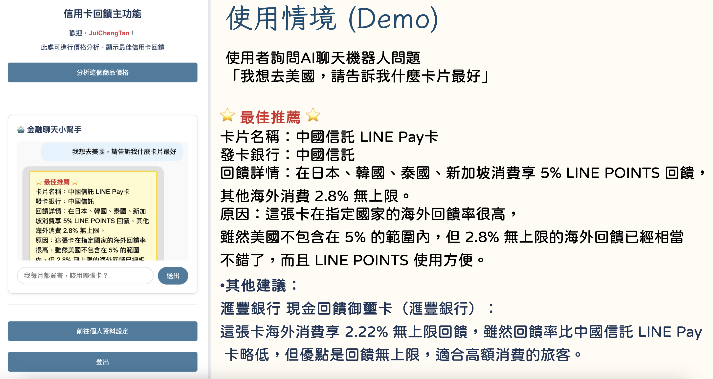
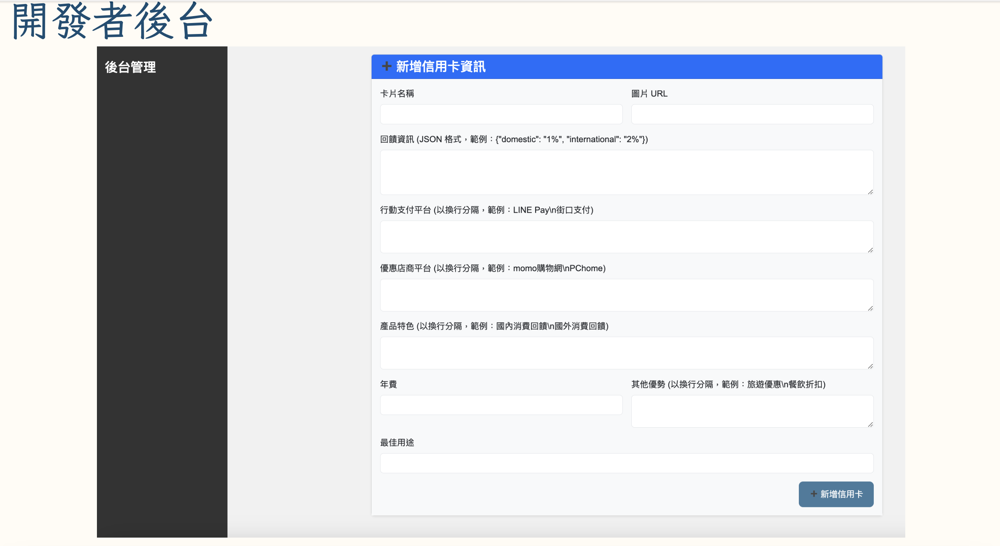

# Sparkful Hackathon 2025

Welcome to our Sparkful Hackathon project repository! This project was developed during the hackathon held on April 26, 2024.

## Simulation: 
A Chrome extension that lets users capture the current page’s price and, using RAG (Retrieval-Augmented Generation) combined with generative AI, recommends which credit card offers the best cashback.

Technologies Used：
Frontend: HTML, CSS, JavaScript
Backend: Node.js, MySQL
Model: RAG+LLM(Gemini-1.5-pro)
## Setup Instructions
### Resetting Node Modules and Reinstalling Dependencies

To properly set up the backend environment, follow these steps in your terminal:

```bash
# Navigate to backend directory
cd backend

# Remove existing node modules and package-lock
rm -rf node_modules
rm package-lock.json

# Install dependencies
npm install

npm install @google/generative-ai
#or
npm install openai

npm install @anthropic/mcp-server

# Start the server
node server.js
```

**Important:** Make sure to open and run the MySQL script `main.sql` before starting the application.

## Project Team

**Developed by:**
- JUI-CHENG, TAN
- CHIH-YAO, YU
- Two additional team members for support

## Project Screenshots

<div align="center">
  
  
  
  
  
  
</div>

## attachment:https://drive.google.com/file/d/1BkWGuO3JWMoFVMI-iHSJ7t4HQ9fRa540/view?usp=drive_link
